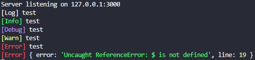

# onset-serverdebugger



**Required:** 
* [NodeJS](https://nodejs.org/)
* [Yarn](https://yarnpkg.com/)

Installation
```
$ yarn
$ npm run build
$ npm run start
```

config.yml
```yaml
host: 127.0.0.1
port: 3000
colors:
  log:    'white'
  info:   'green'
  debug:  'blue'
  warn:   'yellow'
  error:  'red'
```

available colors:
```yaml
black
red
green
yellow
blue
magenta
cyan
white
gray
grey
```